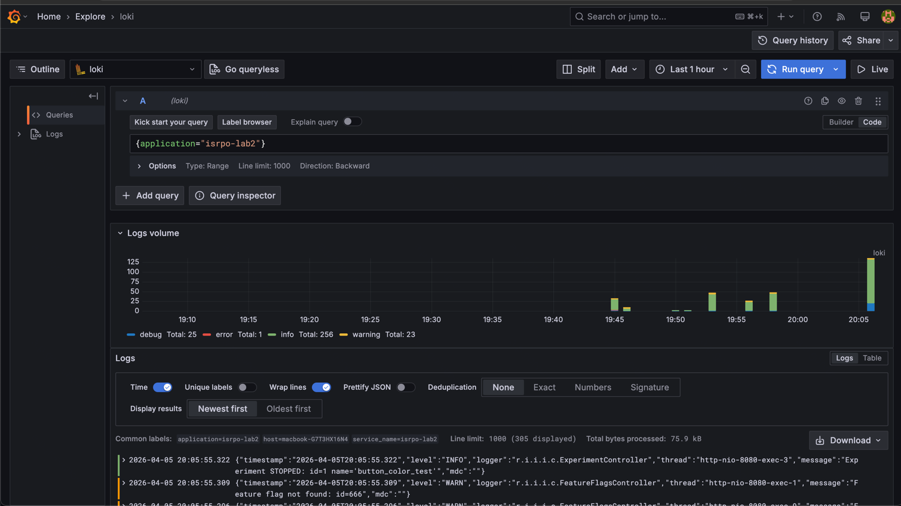
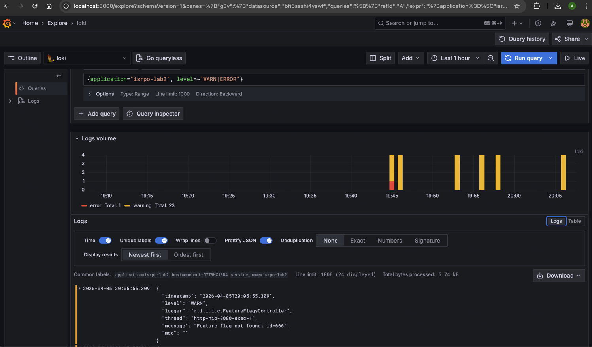
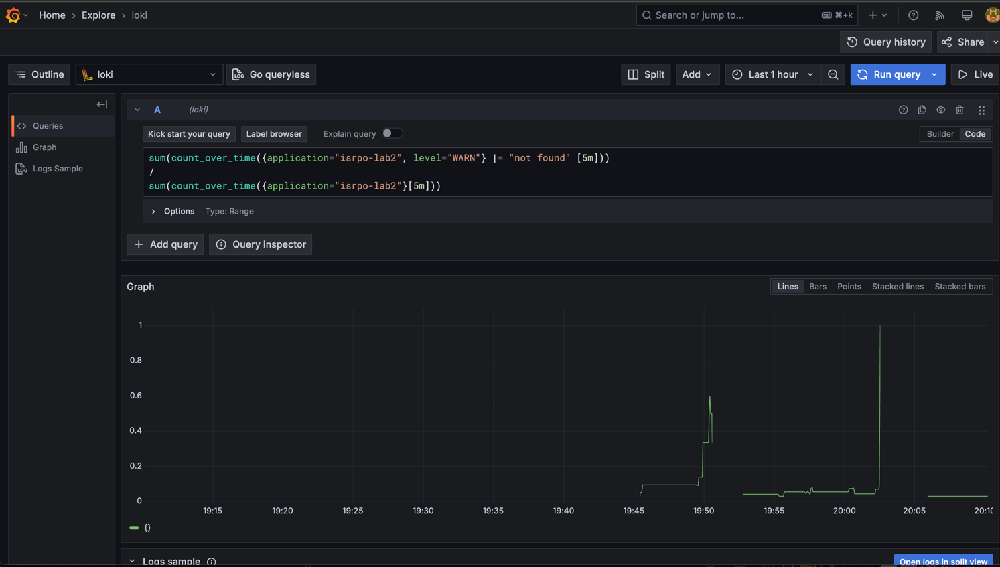
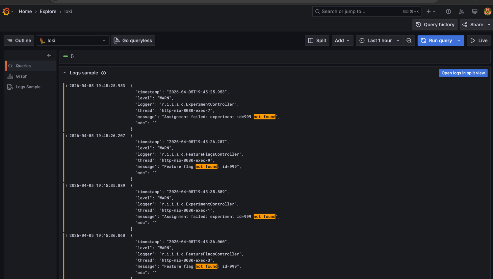
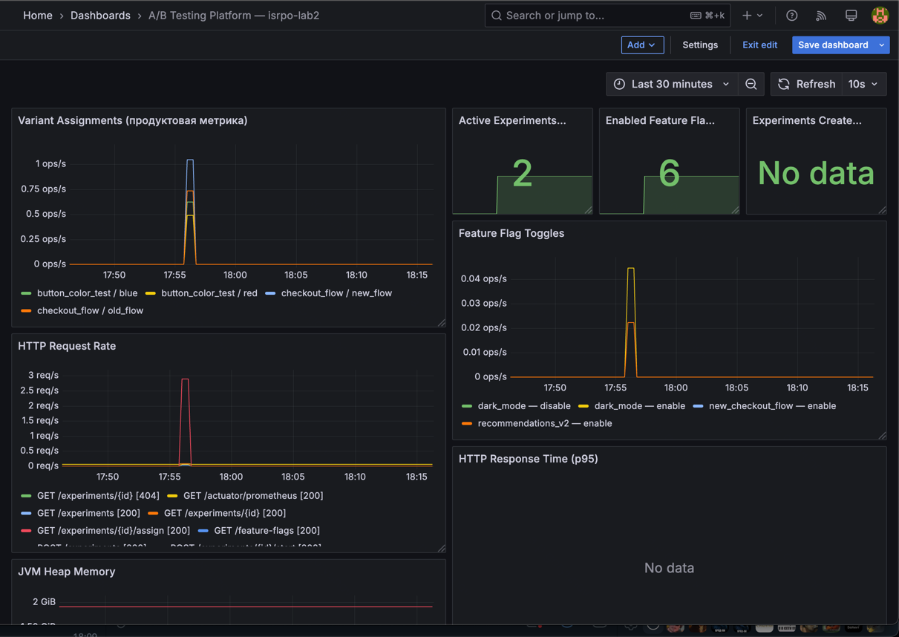
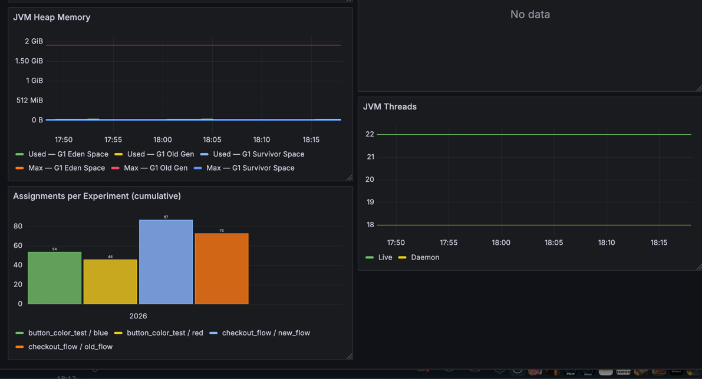
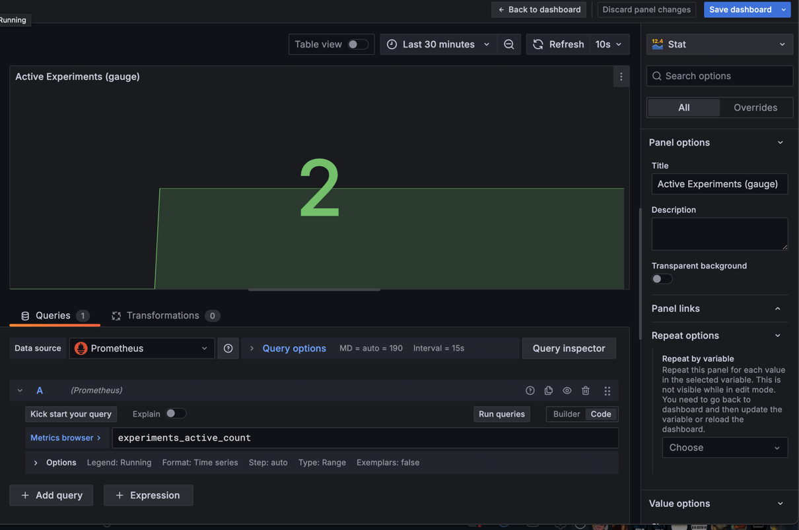
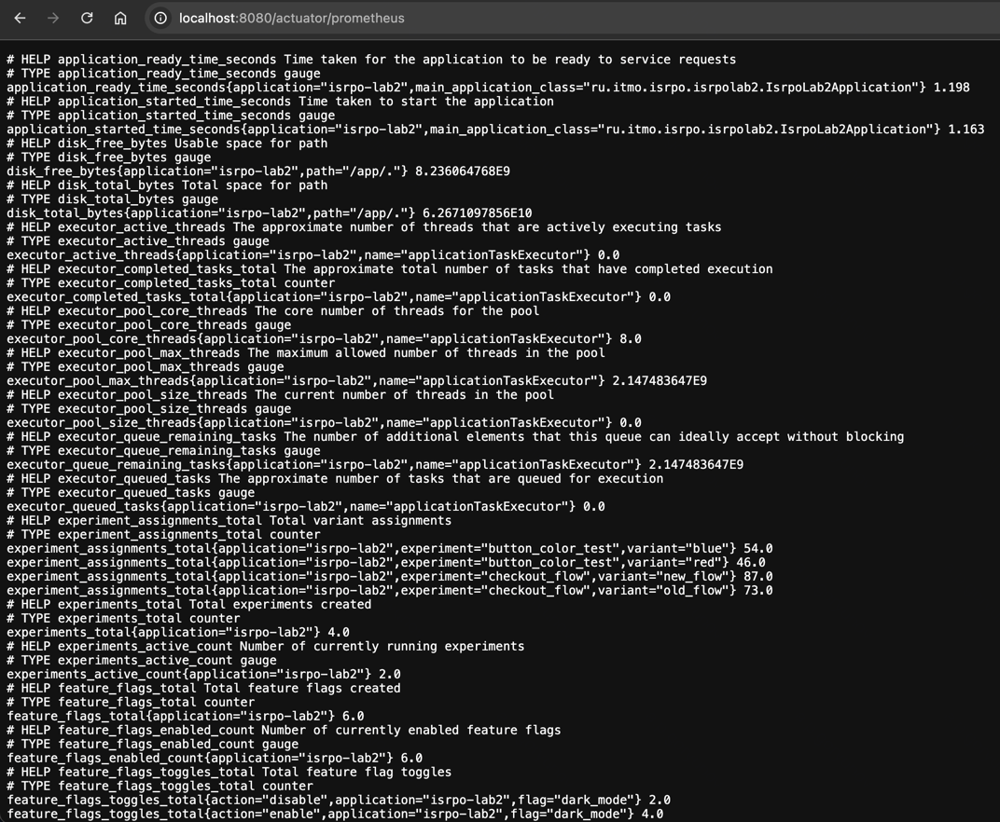
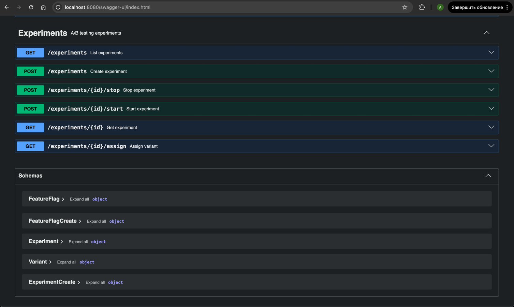
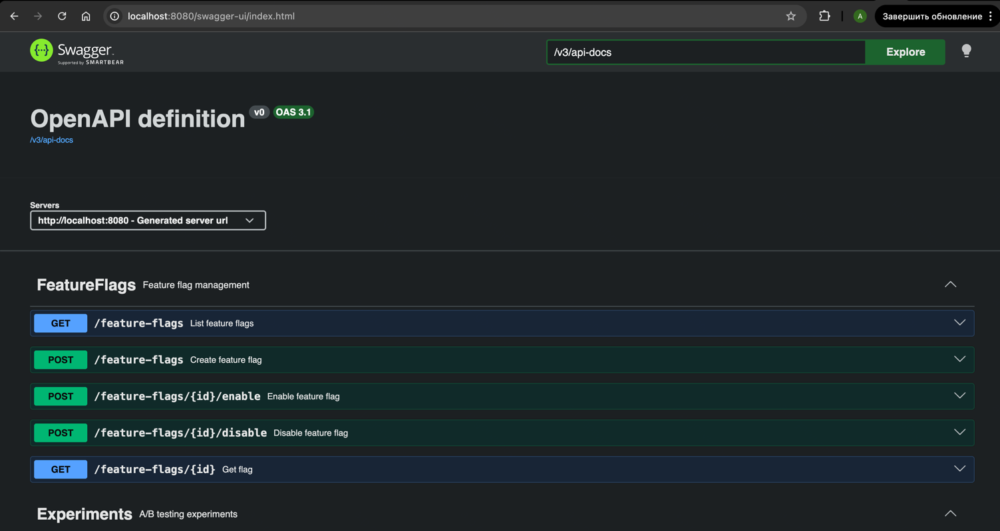

# Лабораторная работа №4
## Экспорт логов, сбор, визуализация, язык запросов

Расширение сервиса из лабораторной работы №3 централизованным сбором логов.

---

## Стек логирования

| Компонент       | Технология               | Назначение                            |
|-----------------|--------------------------|---------------------------------------|
| Логирование     | SLF4J + Logback          | Генерация логов в коде                |
| Экспорт         | Loki4j Logback Appender  | Push логов из приложения в Loki       |
| Хранение        | Grafana Loki             | Агрегация и хранение логов            |
| Визуализация    | Grafana                  | Дашборды, просмотр логов              |
| Язык запросов   | LogQL                    | Запросы к Loki                        |

---

## Что логируется

### Experiments
- Создание эксперимента — `INFO` с именем и количеством вариантов
- Запуск / остановка — `INFO` со статусом
- Назначение варианта — `INFO` с MDC-контекстом (experimentId, experimentName, variant)
- Эксперимент не найден — `WARN`
- Нет вариантов при назначении — `ERROR`

### Feature Flags
- Создание флага — `INFO` с ключом
- Включение / отключение — `INFO` с ключом и действием
- Проверка флага — `DEBUG` с текущим состоянием
- Флаг не найден — `WARN`

### Формат логов

Логи отправляются в Loki в JSON-формате:
```json
{
  "timestamp": "2025-01-15T12:00:00.123",
  "level": "INFO",
  "logger": "r.i.i.c.ExperimentController",
  "thread": "http-nio-8080-exec-1",
  "message": "Variant assigned: experiment='button_color_test' variant='blue' duration_us=142",
  "mdc": "experimentId=1, experimentName=button_color_test, variant=blue"
}
```

Labels в Loki: `application`, `host`, `level`.

---

## Запуск

## Все логи


## С уровнем ERROR и WARN


## Число 404 относительно всех запросов



---

## Дашборд логов в Grafana

Панели:
1. **All Application Logs** — все логи приложения (logs panel)
2. **Errors & Warnings** — только WARN и ERROR уровни
3. **Log Volume by Level** — гистограмма объёма логов по уровням
4. **Variant Assignment Logs** — логи назначений вариантов
5. **Feature Flag Toggle Logs** — логи переключений флагов
6. **Experiment Lifecycle Logs** — создание, старт, остановка экспериментов
7. **Assignment Rate** — график скорости назначений (логов/мин)

# Лабораторная работа №3
## Метрики для платформы A/B тестирования

Расширение сервиса из лабораторной работы №2 метриками, сбором в TSDB и визуализацией.

---

## Стек мониторинга

| Компонент        | Технология         | Назначение                       |
|------------------|--------------------|----------------------------------|
| Инструментация   | Micrometer         | Сбор метрик в коде               |
| Экспорт          | Spring Boot Actuator + Prometheus exporter | Отдача метрик в формате Prometheus |
| TSDB             | Prometheus         | Хранение временных рядов         |
| Визуализация     | Grafana            | Дашборды, графики                |
| Язык запросов    | PromQL             | Запросы к Prometheus             |

---

## Продуктовые метрики

### `experiment.assignments.total` (Counter) — **главная продуктовая метрика**
Считает, сколько раз каждый вариант каждого эксперимента был назначен пользователю.
Теги: `experiment`, `variant`.

### `experiments.created.total` (Counter)
Общее число созданных экспериментов.

### `experiments.active.count` (Gauge)
Количество экспериментов в статусе RUNNING прямо сейчас.

### `feature_flags.toggles.total` (Counter)
Количество переключений feature flags. Теги: `flag`, `action`.

### `feature_flags.created.total` (Counter)
Общее число созданных feature flags.

### `feature_flags.enabled.count` (Gauge)
Количество включённых feature flags прямо сейчас.

---

## Стандартные метрики (через Actuator)

Кроме продуктовых метрик автоматически собираются:
- HTTP-метрики (количество запросов, время ответа, статус-коды)
- JVM-метрики (heap, threads, GC)
- System-метрики (CPU, uptime)

---

## Запуск

```bash
docker-compose up --build
```

| Сервис      | URL                          |
|-------------|------------------------------|
| Приложение  | http://localhost:8080         |
| Swagger UI  | http://localhost:8080/swagger-ui.html |
| Prometheus  | http://localhost:9090         |
| Grafana     | http://localhost:3000 (admin/admin) |

---

---

## Примеры PromQL запросов

Полный список — в файле [PROMQL_EXAMPLES.md](PROMQL_EXAMPLES.md).

Быстрые примеры:

```promql
# Скорость назначений вариантов
rate(experiment_assignments_total[1m])

# Распределение по вариантам
sum by (variant) (experiment_assignments_total{experiment="button_color_test"})

# Количество активных экспериментов
experiments_active_count

# 95-й перцентиль времени ответа
histogram_quantile(0.95, rate(http_server_requests_seconds_bucket[1m]))
```

---

## Дашборд Grafana

Дашборд подгружается автоматически при запуске через provisioning.




Панели:
1. **Variant Assignments** — rate назначений вариантов по экспериментам (timeseries)
2. **Active Experiments** — gauge текущих запущенных экспериментов (stat)
3. **Enabled Feature Flags** — gauge включённых флагов (stat)
4. **Feature Flag Toggles** — rate переключений (timeseries)
5. **HTTP Request Rate** — запросы в секунду по эндпоинтам (timeseries)
6. **HTTP Response Time p95/p50** — перцентили времени ответа (timeseries)
7. **JVM Heap Memory** — использование памяти (timeseries)
8. **JVM Threads** — количество потоков (timeseries)
9. **Assignments per Experiment** — кумулятивная гистограмма назначений (barchart)

---

## Эндпоинт метрик

После запуска метрики доступны по адресу:

```
http://localhost:8080/actuator/prometheus
```

Пример вывода:




# Лабораторная работа №2  
## Платформа для A/B тестирования

REST API сервис для управления **A/B экспериментами** и **feature flags**.

Проект демонстрирует использование подхода **API-first** с применением **OpenAPI спецификации** и **автоматической генерации кода**.

---

# Подход API-first

Сервис был разработан с использованием подхода **API-first**:

1. Сначала был описан API с помощью **OpenAPI 3.0 спецификации** (`openapi.yaml`)
2. Затем с помощью **OpenAPI Generator** были сгенерированы интерфейсы для Spring
3. После этого была написана реализация этих интерфейсов с использованием **Spring Boot**

Такой подход позволяет разделить:

- контракт API
- реализацию сервиса
- документацию

---

# Используемые технологии

- Java 21
- Spring Boot
- Gradle
- OpenAPI 3
- OpenAPI Generator
- Swagger UI

---

# Структура проекта

```

src
├── main
│ ├── java
│ │ └── ru.itmo.isrpo
│ │ ├── controller
│ │ │ ├── ExperimentsController.java
│ │ │ └── FeatureFlagsController.java
│ │
│ └── resources
│
openapi.yaml

build/generated

```

Сгенерированные классы:

```

ru.itmo.isrpo.api
├── ExperimentsApi
└── FeatureFlagsApi

ru.itmo.isrpo.model
├── Experiment
├── ExperimentCreate
├── Variant
├── FeatureFlag
└── FeatureFlagCreate

```

---

# API сервиса

Платформа содержит два основных модуля:

## Experiments (A/B эксперименты)

Позволяет управлять экспериментами.

Эндпоинты:

```

GET /experiments
POST /experiments
GET /experiments/{id}
POST /experiments/{id}/start
POST /experiments/{id}/stop
GET /experiments/{id}/assign

````

Пример эксперимента:

```json
{
  "name": "button_color_test",
  "variants": [
    { "name": "blue", "weight": 50 },
    { "name": "red", "weight": 50 }
  ]
}
````

---

## Feature Flags

Позволяет включать и выключать функциональность в приложении.

Эндпоинты:

```

GET /feature-flags
POST /feature-flags
GET /feature-flags/{id}
POST /feature-flags/{id}/enable
POST /feature-flags/{id}/disable

```

Пример feature flag:

```json
{
  "key": "new_checkout_flow"
}
```

---

# Запуск приложения

Запуск сервера:

```

./gradlew bootRun

```

Сервис будет доступен по адресу:

```

http://localhost:8080

```

Swagger UI:

```

http://localhost:8080/swagger-ui.html

```

---

# Swagger UI

API автоматически документируется через Swagger.

### Experiments API



### Feature Flags API



---

# Пример использования

Создание эксперимента:

```

POST /experiments

```

Запуск эксперимента:

```

POST /experiments/{id}/start

```

Получение варианта для пользователя:

```

GET /experiments/{id}/assign

```

Включение feature flag:

```

POST /feature-flags/{id}/enable

```

---

# Примечание

В данной реализации используется **in-memory хранение данных** (в памяти приложения).

Основная цель работы — продемонстрировать:

* подход API-first
* использование OpenAPI
* генерацию кода через OpenAPI Generator
* проектирование REST API

```